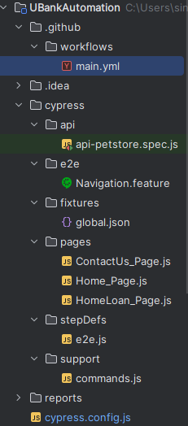
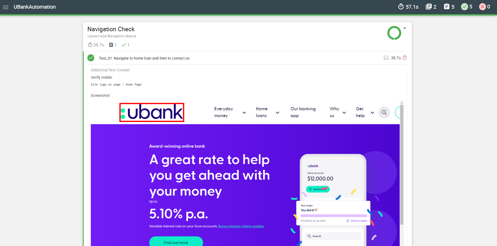
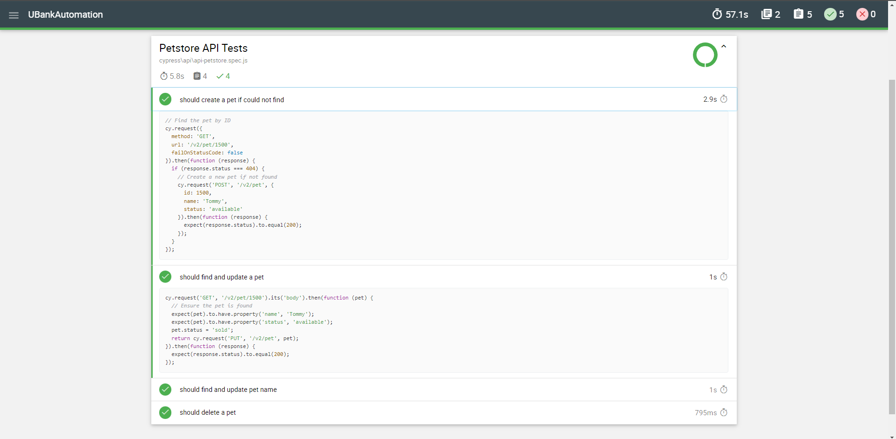
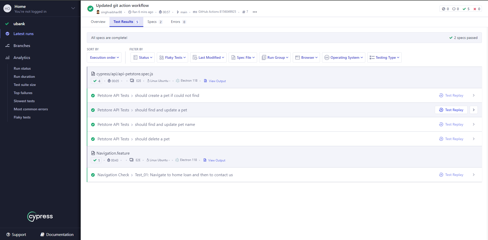
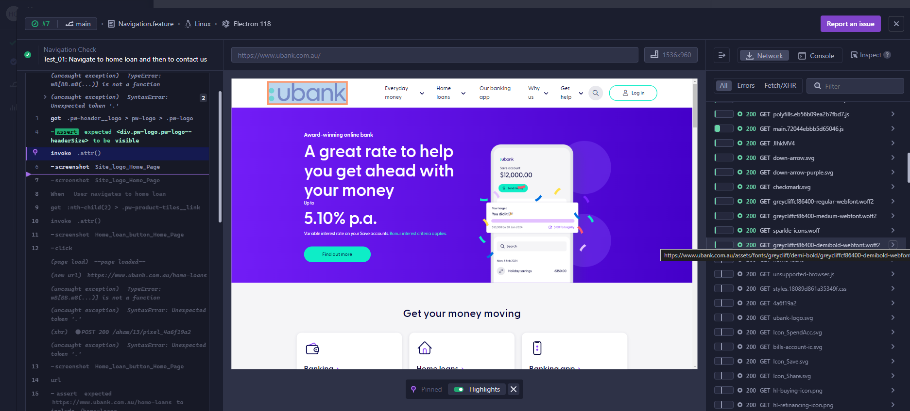
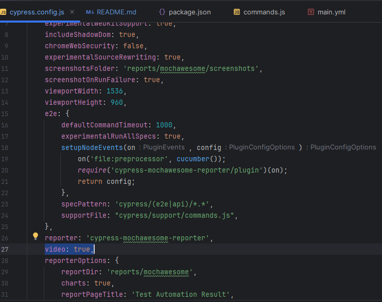

# Cypress Automation Excercise

UI & API Automation Assignment

### Github https://github.com/singhvaibhav98/cypress-ub

#### Key Features
- Cucumber based cypress framework implementation
- UI & API Automation using cypress
- Mochawesome reporting
- Github action configured
- POM model with extended framework consisting reusable library
- Highlighted action and validation over UI with Red border to see exact changes
- Customisable screenshots, as of now enable for each action/validation.

## Folder Structure

- .github/workflows/main.yml
  _Github Action file to run the scripts
  _Sample : https://github.com/singhvaibhav98/cypress-ub/actions/runs/8156049925

- api/api-petstore.spec.js
  _This contains rest api test scripts

- e2e/Navigation.feature
  _This contains all the test cases in cucumber format

- cypress/fixtures/**.json
  _This consists all the test data files

- pages/**.js
  _These js files contains page elements with other details such as an alias to identify the element in report and page
  name. We have option to use cy.get or cy.xpath as well to identify and allocate the elements_

- support/command.js
  _This contains custom wrapper and utilities methods to take action and log in report as well_

## Reporting
##### Mochawesome
Customised reporting to assist tester read and understand the flow. Actionable items are highlighted in red across reports
and video evidences

reports/mochawesome/index.html

##### Cypress cloud
Allows monitoring UI Actions as well as network logs
Sample - https://cloud.cypress.io/projects/j7zetb/runs/7

##### Video Evidence
Video will be recorded based on below flag and will be saved in report folder
