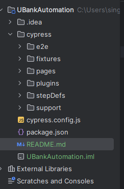

# Cypress Automation Excercise
### https://www.ubank.com.au/

#### Folder Structure

- components/Components.js
  _This contains reusable flows of the application such as com_openurl, com_registraion, com_delete_account etc. These flows internally calls action methods from support/command.js and operate action of page elements from pages folder_

- e2e/demo.cy.js
  _This contains all the test cases, the test cases are calling component flows_

- pages/**.js
  _These js files contains page elements with other details such as an alias to identify the element in report and page name. We have option to use cy.get or cy.xpath as well to identify and allocate the elements_

- support/command.js
  _This contains custom wrapper and utilities methods to take action and log in report as well_

#### Reporting
Using mochawesome report for reporting purpose. Use below command to run test case and generate report. Screenshots are being taken after each action
_npx cypress run --reporter mochawesome_

#### Issues
Add to cart button not working even manually in cypress browser window.